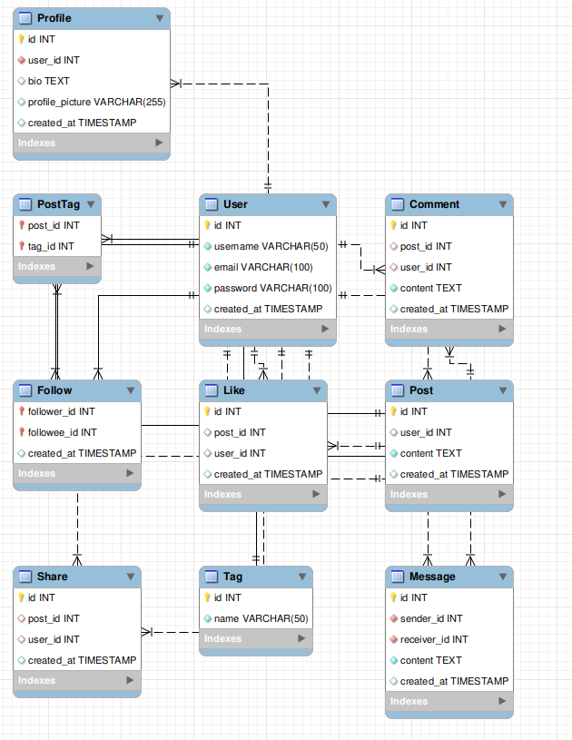

# newsfeed-app

## ERD Diagram

<center>
    
</center>

## How to run

1. Create a virtual environment

```bash
python -m venv venv
```

2. Activate the virtual environment

```bash
source venv/bin/activate
```

3. Install dependencies

```bash
pip install -r requirements.txt
```

4. Create the database

```bash
python db/create_db.py
```

5. Migrate the database

```bash
python db/migrate.py
```

6. Run the app

```bash
flask run
```

7. Run the tests

```bash
pytest test_app.py
```

## API Documentation

| Endpoint       | Methods | Rule                    |
| -------------- | ------- | ----------------------- |
| add_comment    | POST    | /comment                |
| add_follow     | POST    | /follow                 |
| add_like       | POST    | /like                   |
| add_message    | POST    | /message                |
| add_post       | POST    | /post                   |
| add_post_tag   | POST    | /posttag                |
| add_profile    | POST    | /profile                |
| add_share      | POST    | /share                  |
| add_tag        | POST    | /tag                    |
| add_user       | POST    | /user                   |
| delete_post    | DELETE  | /post/<int:post_id>     |
| get_post_by_id | GET     | /post/<int:id>          |
| get_user       | GET     | /user/<int:user_id>     |
| static         | GET     | /static/<path:filename> |
| update_post    | PUT     | /post/<int:post_id>     |
